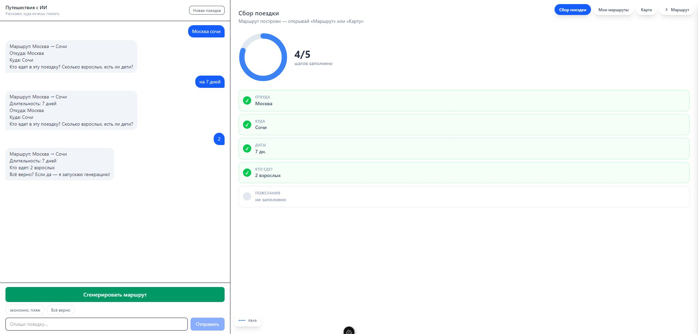
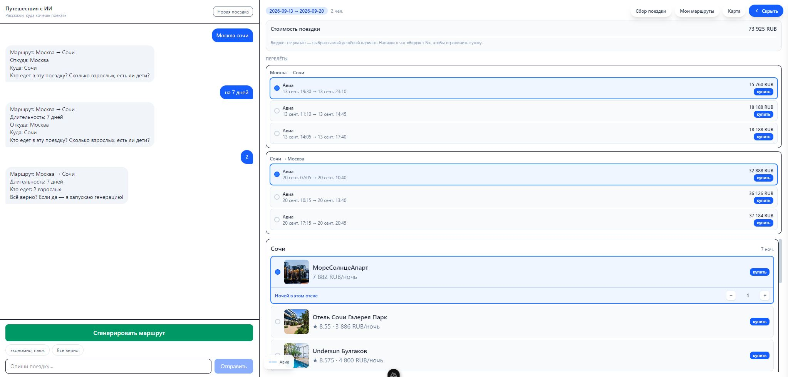
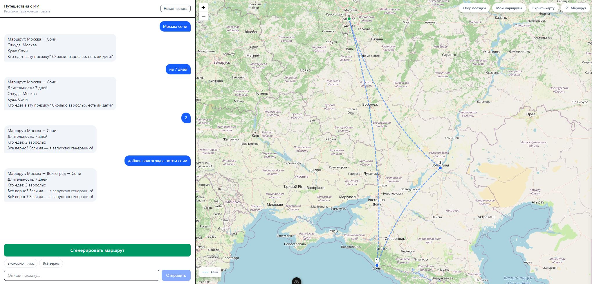

# Планировщик путешествия с ИИ-помощником

Демо-проект для хакатона  
Интерактивный планировщик путешествий. Вы описываете, куда и когда хотите поехать, а ассистент в чате собирает готовый маршрут — с транспортом, отелями.

Проект построен для реализации идей на основе **MCP-сервера Туту**
Ссылка на открытый MCP (https://mcp.tutu.ru/mcp)

- **Транспорт.** Перелёты, поезда и автобусы между городами маршрута с учётом пожеланий - самолетом, на ж/д итд.
- **Отели.** Варианты проживания с ценами в каждом городе.
- **Карта маршрута.** Визуализация маршрута на карте.

## Скриншоты







## Запуск

```bash
nuxt-app
npm run dev
```

Приложение: http://localhost:3000
