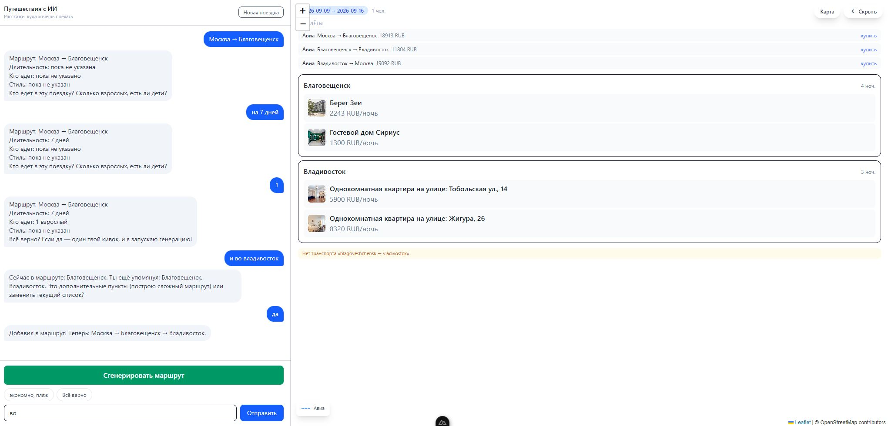
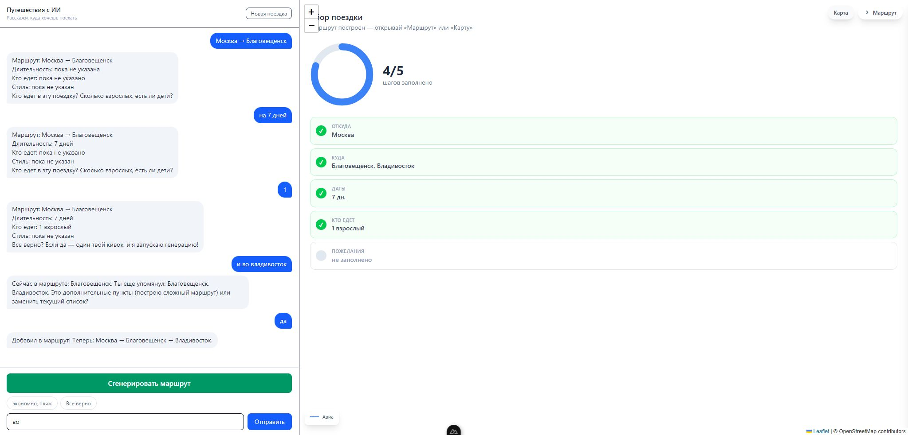
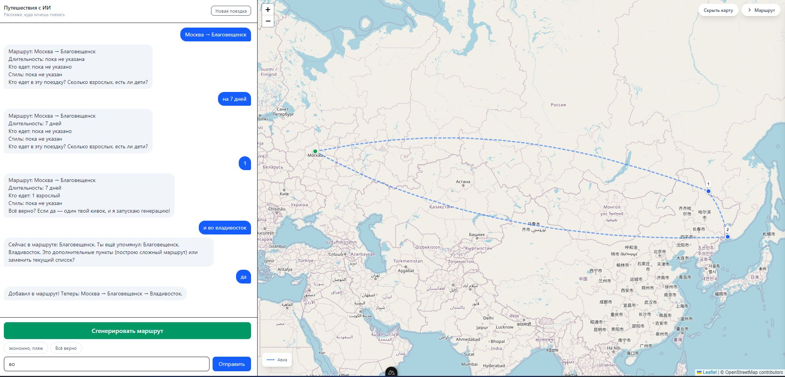

# Путешествия с ИИ-помощником

Интерактивный планировщик путешествий: вы просто описываете, куда и когда хотите поехать, а ассистент в чате собирает готовый маршрут — с транспортом, отелями и картой.

## Как это работает

Никаких сложных форм — просто напишите ассистенту, например:

- «хочу полететь из Москвы во Владивосток на неделю»
- «давай поедем на поезде, втроём, с 1 августа»
- «добавь ещё один город по пути»
- «замени аэропорт вылета на ближайший»

Помощник сам уточнит недостающее, предложит варианты и за один раз соберёт весь маршрут.

## Что умеет ассистент

- **Подбор городов.** Можно добавить город в маршрут или заменить уже выбранный — достаточно сказать об этом в чате.
- **Транспорт.** Подбирает перелёты, поезда и автобусы между городами маршрута. Если вы хотите ехать именно поездом — скажите об этом, и ассистент учтёт пожелание.
- **Отели.** Показывает варианты проживания с ценами в каждом городе.
- **Карта маршрута.** Наглядно видно весь путь от точки до точки.
- **Покупка.** Напротив каждого варианта есть кнопка «купить» — она ведёт на страницу с билетом.

## Как пользоваться

1. Откройте сайт и напишите в чат, куда хотите поехать.
2. Отвечайте на уточняющие вопросы (даты, количество человек, предпочтения).
3. Когда всё готово — подтвердите, и ассистент соберёт маршрут.
4. Изучите карту, варианты транспорта и отелей, переходите к покупке по кнопкам «купить».

## Скриншоты

Общение с ассистентом:

Сборка маршрута:

Готовый маршрут на карте:

## Советы

- Уточняйте транспорт заранее: «на ж/д», «поездом», «самолётом» — ассистент выберет нужный вид.
- Указывайте конкретные даты — так цены и расписания будут точнее.
- Маршрут можно менять после сборки: просто напишите «замени город» или «добавь остановку».

## Частые вопросы

**Как купить билет или отель?** Нажмите кнопку «купить» рядом с подходящим вариантом — откроется страница покупки.

**Можно ли вернуться и поменять маршрут?** Да, напишите ассистенту — он скорректирует поездку.
